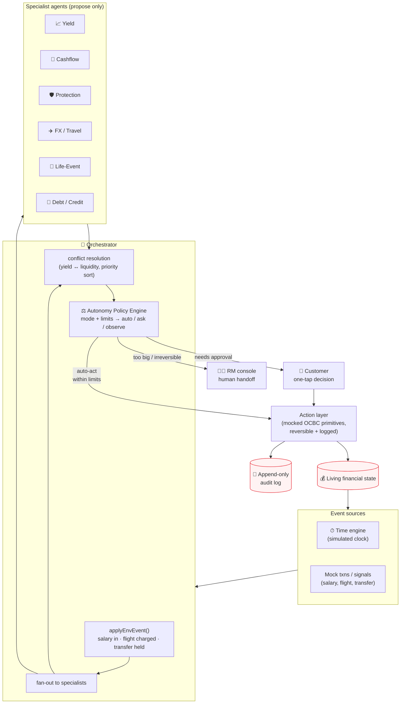
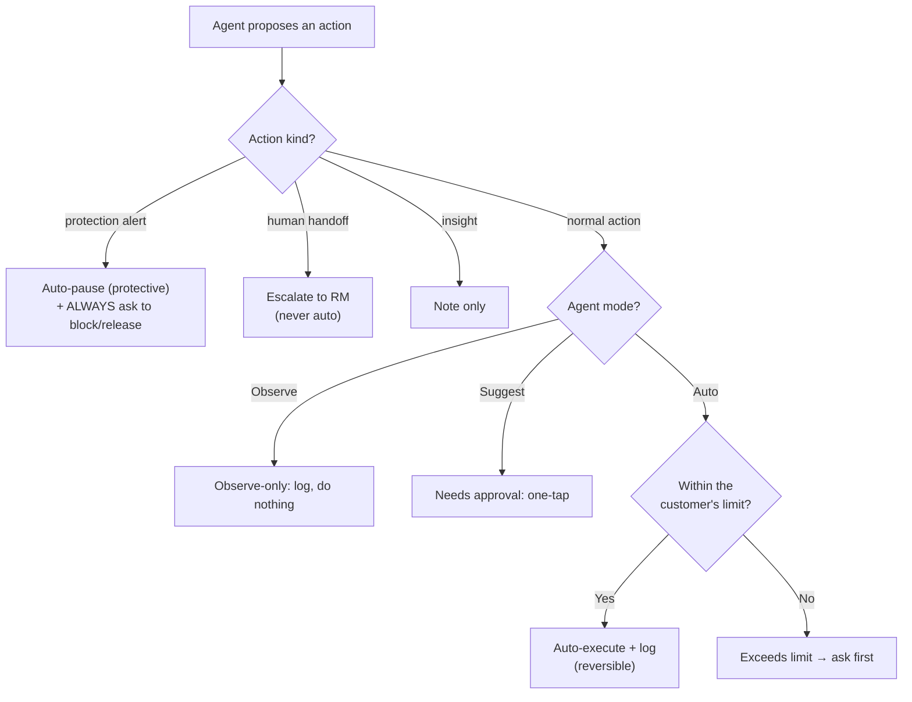
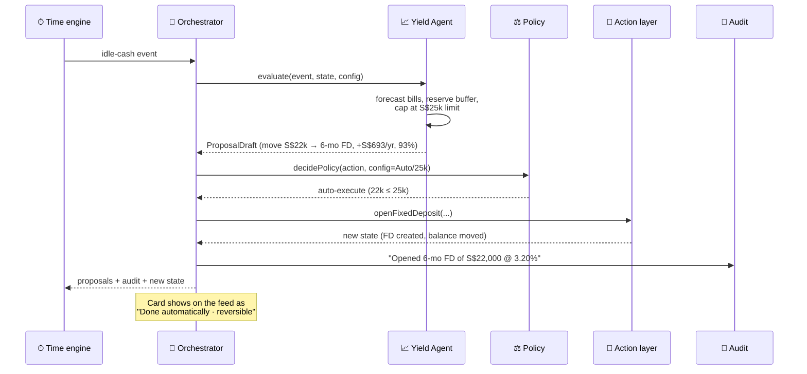

# OCBC Ahead — Architecture

## System overview

**The rule:** *agents propose, the orchestrator disposes.* No agent ever touches money directly. Every proposed action passes through `decidePolicy()` first, and every executed action is written to the audit log.

---

## Components

| Layer | File(s) | Responsibility |
|---|---|---|
| **Time engine** | `src/store/useSimulation.ts`, `shared/events.ts` | Advances a simulated clock; applies each event's real-world effect (salary credited, flight charged, transfer held) before agents see state. |
| **Specialist agents** | `shared/agents/*.agent.ts` | Each watches for relevant events and returns a `ProposalDraft` with reasoning, confidence, data used, projected outcome, and a proposed action. **They never execute.** |
| **Orchestrator** | `shared/agents/orchestrator.ts` | Fans events out to all agents, resolves conflicts, prioritises, runs the policy gate, executes/escalates, writes audit entries. |
| **Autonomy policy engine** | `shared/agents/policy.ts` | The single decision point: `(action, agentConfig) → auto-execute │ needs-approval │ observe-only`, in plain English. |
| **Action layer** | `shared/tools.ts` | Mocked OCBC primitives (Fixed Deposit, Money Lock, FX lock, transfers, escalate). Pure, reversible, audit-friendly. |
| **Reasoning** | `shared/reasoning/` | `scripted.ts` (deterministic offline "why/what-if") + `prompts.ts` (Claude system prompts & tool schemas). |
| **Frontend** | `src/components/**` | Agent feed, control center, decision log, Ask panel, RM console, presenter panel. |
| **Backend (optional)** | `server/**` | Express + Claude. `/api/ask` (grounded Q&A) and `/api/reason` (real multi-agent tool-use loop). |

### Why the engine lives in `shared/`
It's pure, DOM-free TypeScript, so the **same code runs in the browser (offline demo) and in Node (`npm run smoke`, and the server)**. One source of truth for agent behaviour; the LLM path is an *enhancement*, never a dependency.

---

## The autonomy policy engine (the heart of "humans in control")

Defaults encode a **risk-tiered philosophy**:

| Agent | Default mode | Why |
|---|---|---|
| Yield | **Auto** ≤ S$25k | Reversible, low-risk, high-value → let it act, keep a buffer. |
| Cashflow | **Auto** ≤ S$3k allocation | Within preset %; *shortfall* decisions are multi-option → always ask. |
| Protection | **Suggest (floor)** | Safety-critical: auto-*pauses* (protective) but can never be silenced or auto-release. |
| FX / Travel | **Suggest** | Market-timing is a judgment call → propose, don't impose. |
| Life-Event | **Observe** | Informational; shapes other agents, moves no money. |
| Debt / Credit | **Observe → escalate** | Refinance is big & irreversible → a human must own it. |

---

## One scenario, end to end (idle cash → yield)

The customer can tap **Undo** (reverses via `revertAction()`), **Ask** ("why did you keep S$22k and not S$25k?"), or change the Yield Agent's dial/limit — all without leaving the feed.

---

## The real-LLM path (`npm run dev:full`)

- **`/api/ask`** — builds a *grounded* prompt from the specific decision record (reasoning, confidence, data, policy) and asks an LLM to answer the customer's "why / what-if" in plain English. **Provider-pluggable:** uses **Google Gemini** (free tier) if `GEMINI_API_KEY` is set, otherwise **Claude**. The system prompt forbids inventing data.
- **`/api/reason`** — a genuine **multi-agent tool-use loop**: the orchestrator system prompt + mocked OCBC tools (`getAccounts`, `forecastCashflow`, `openFixedDeposit`, `pauseTransfer`, `escalateToHuman`…). Claude inspects the customer's state with tools, decides, and explains. Returns the answer **and the tool-call trace**.
- **Model:** Ask uses `gemini-2.5-flash` (free, via `GEMINI_API_KEY` / `GEMINI_MODEL`) or `claude-sonnet-4-6` (via `ANTHROPIC_API_KEY` / `ANTHROPIC_MODEL`); the `/reason` tool-loop uses Claude.
- **Resilience:** the frontend only *enhances* with this; any failure falls back to the deterministic `scripted.ts` engine. The API key lives **only** on the server — never in the browser.

---

## Responsible AI & trust

This is the section that makes the concept *bankable*. Trust is engineered in, not bolted on.

| Principle | How it's implemented |
|---|---|
| **Explainability** | Every proposal carries `reasoning[]`, `confidence`, `dataUsed[]`, `projectedOutcome[]`, and a plain-English `policy.reason`. The customer can ask "why?" / "what if?" and get a grounded answer (LLM or scripted). No black boxes. |
| **Human-in-the-loop** | A per-agent autonomy dial (Observe → Suggest → Auto) + spending limits, as a **first-class screen**, not a buried setting. The customer sets the boundary; the agent stays inside it. |
| **Guardrails** | Every action passes `decidePolicy()` before execution. Auto-action is bounded by user limits and a liquidity buffer; exceeding a limit downgrades to "ask first". |
| **Auditability** | Append-only decision log: who (agent), what, why, when, confidence — in plain English. Nothing happens off the record. |
| **Reversibility** | Money-moving actions are reversible in one tap (`revertAction()` restores exact balances). The agent acts confidently *because* mistakes are cheap. |
| **Data minimisation** | Agents reason on the customer's own OCBC data; `dataUsed[]` is shown explicitly. In the LLM path, only the relevant decision record + a thin account snapshot are sent — not the full history. |
| **Human sign-off where it matters** | Large or irreversible decisions (mortgage refinance, large investment) are **never** auto-executed — they're escalated to an RM with full context. Protection can never be turned down to silent. |
| **Safety floor** | The Protection Agent's autonomy cannot be set below "Suggest" — fraud defence can't be accidentally disabled. |

### Where a human *must* sign off
- Any **money leaving** the bank to a new/anomalous payee (Protection → confirm/block).
- Any **large or irreversible** product decision (Debt/Life-Event → RM handoff).
- Any agent action that **exceeds the customer's configured limit** (downgraded to approval).

### Production hardening (next steps)
Real OCBC service integration behind the `tools.ts` interface; step-up auth (biometric/2FA) on release-from-Money-Lock and high-value approvals; immutable, regulator-ready audit storage; model-decision logging + evaluation harness; per-agent rate limits and kill-switch; PDPA-aligned data-minimisation review.
